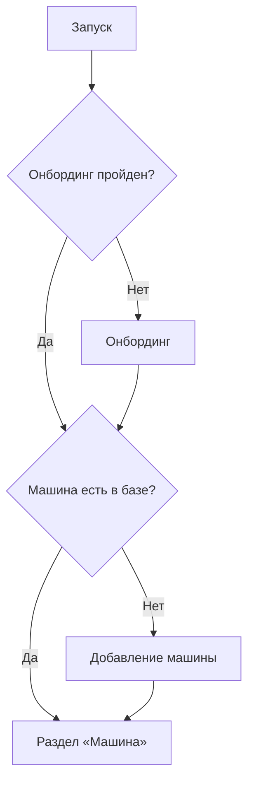

# Экраны и user flows

Приложение собирается по макетам Figma (файл `9GXgWezTGI6TjklsnuBns2`).
Ниже — то, что реально реализовано в коде.

## Экраны

| Экран | Файл | Figma |
|---|---|---|
| Онбординг | `Features/Onboarding/OnboardingView.swift` | `45822:3994` |
| Добавление машины | `Features/AddCar/AddCarView.swift` | секция `45854:2880` |
| «Это ваш автомобиль?» | `Features/AddCar/CarFoundSheet.swift` | `45854:2936` |
| Раздел «Машина» | `Features/Main/CarMainView.swift` | `45867:3007`, `45949:3477` |
| Добавление ТО | `Features/Main/AddServiceSheet.swift` | `45870:2868` |
| Выбор способа добавления ТО | `Features/Main/AddServiceChoiceSheet.swift` | `45883:3842` |
| Добавление ещё одной машины | `Features/Main/AddCarSheet.swift` | `45974:5159` |

## Маршрутизация

Задана в `Navigation/RootView.swift`:

Признак «машина есть» берётся из SwiftData-запроса, а не из флага
в `UserDefaults` — иначе состояние разъезжается с данными. В `UserDefaults`
остался только `hasCompletedOnboarding`.

## Добавление машины

Две вкладки сегментед-контрола:

- **По номеру** — поле с маской `PlateFormat`: латиница превращается в
  кириллицу, пробелы расставляются сами, формат `В 777 ОР 777`, регион
  из 2 или 3 цифр. По кнопке «Добавить» ищем машину и показываем шторку
  «Это ваш автомобиль?». Поиск пока заглушка на номере `В 777 ОР 777`
  с данными из макета — заменится вызовом API.
- **По названию** — название, пробег и фото.

Ошибки: тряска поля плюс негативный хаптик — по аннотации в макете.

## Раздел «Машина»

Карусель из двух страниц: машина и «Добавить авто». Пока история ТО пуста —
пустое состояние; после первой записи появляются блоки «ТО через N км»,
«Всего потрачено», «Количество ТО» и лента истории.

«ТО через N км» считается от пробега на последнем ТО плюс межсервисный
интервал 10 000 км.

Добавление ТО — через шторку выбора: фото/PDF (парсер вытащит дату, сумму
и работы; сейчас заглушка `applyParsedService`) или ручной ввод.

## Вход

Кнопка «Войти с Apple» в онбординге есть по макету, но аккаунтов пока нет:
данные лежат на устройстве, и обработчик просто продолжает флоу.
Авторизация появится вместе с сервером — [BACKEND.md](BACKEND.md).

## Хранение

Всё локально в SwiftData — `Models/Car.swift` и `Models/ServiceRecord.swift`.
Удаление машины каскадом удаляет её ТО, работы и чеки.
