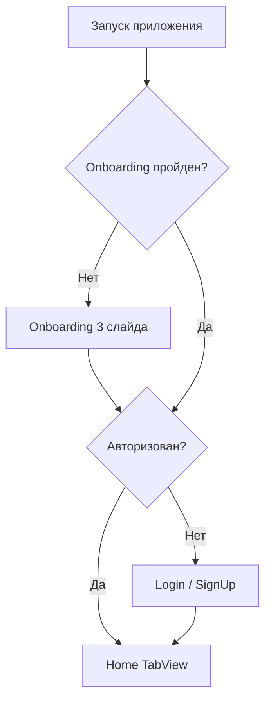

# MVP: экраны и user flows

Базовый MVP для первой сборки в TestFlight (5 экранов).  
Когда будет ссылка на Figma — замените placeholder-стили в `Theme.swift` и экранах на токены из макета.

## Экраны MVP

| # | Экран | Figma frame (замените) | Назначение |
|---|-------|------------------------|------------|
| 1 | Onboarding | `Onboarding` | 3 слайда: ценность продукта |
| 2 | Login | `Login` | Вход по email + пароль |
| 3 | SignUp | `SignUp` | Регистрация |
| 4 | Home | `Home` | Главный список данных (Tab 1) |
| 5 | Profile | `Profile` | Профиль и выход (Tab 2) |

## User flows

### Flow 1: Первый запуск

### Flow 2: Авторизация

1. Пользователь вводит email и пароль на **Login**
2. `AuthService` → Supabase `signIn`
3. Успех → **Home**; ошибка → alert с текстом

### Flow 3: Регистрация

1. **SignUp** → email, пароль, подтверждение пароля
2. Supabase `signUp` → письмо подтверждения (если включено в Dashboard)
3. После подтверждения → **Login** → **Home**

### Flow 4: Главный экран

1. **Home** загружает список `items` из Supabase
2. Состояния: loading → content / empty / error
3. Pull-to-refresh обновляет список

### Flow 5: Профиль

1. Показ email пользователя
2. Кнопка **Выйти** → Supabase `signOut` → **Login**

## Состояния UI (отметьте в Figma)

Для каждого экрана с данными:

- **Loading** — `ProgressView`
- **Empty** — иллюстрация + CTA
- **Error** — сообщение + «Повторить»
- **Success** — основной контент

## Что заменить из Figma

1. Цвета → `AppMVP/Core/Design/Theme.swift`
2. Шрифты и отступы → `AppSpacing`, `AppTypography`
3. Компоненты → `PrimaryButton`, `AppTextField`
4. Layout экранов → файлы в `AppMVP/Features/`

Пришлите ссылку на Figma-файл — экраны можно перегенерировать под макет.
